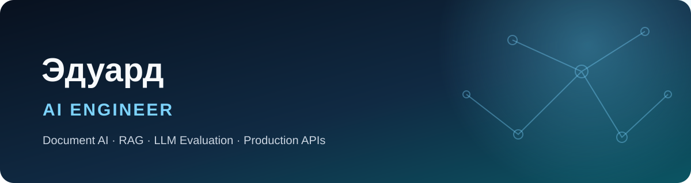
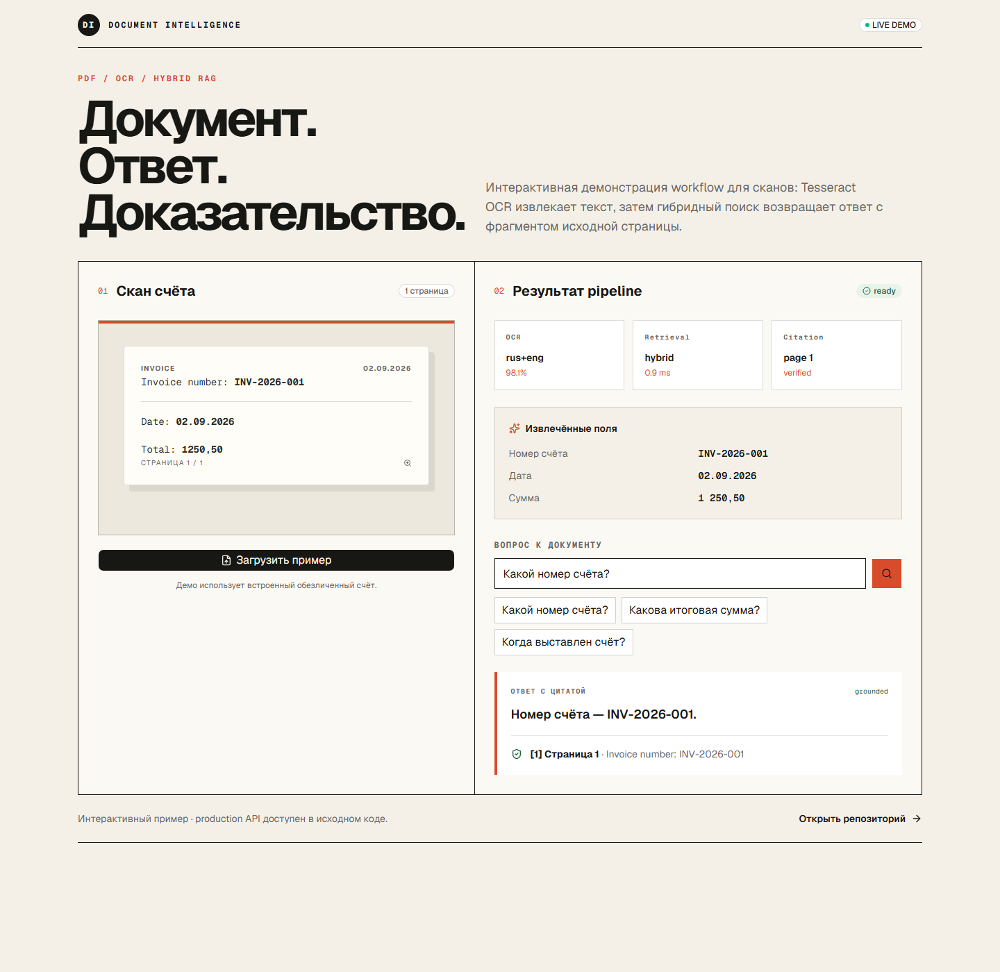
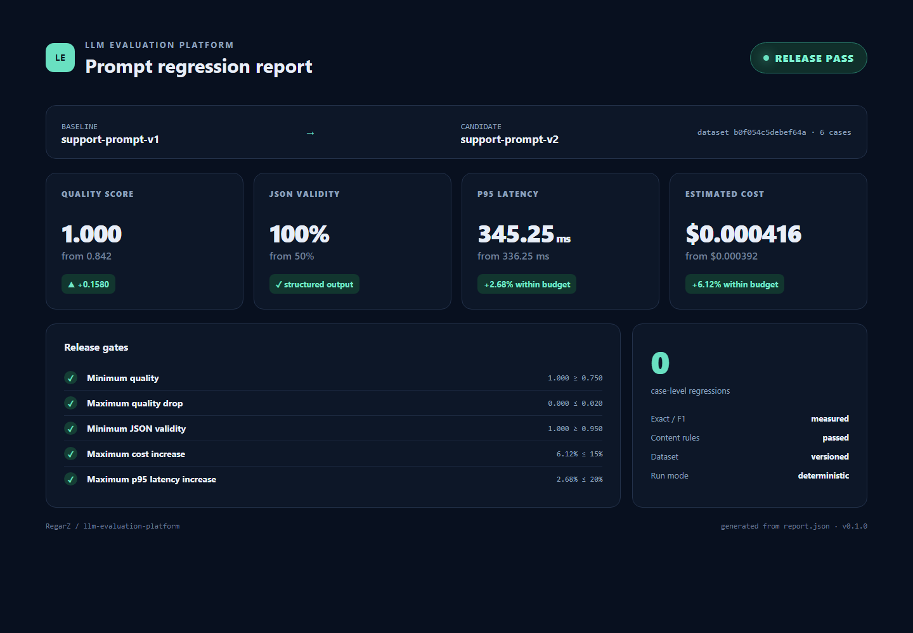

  

   

  <b>Создаю прикладные AI-системы, результат которых можно проверить:</b> 
  Document Intelligence · RAG с цитатами · LLM Evaluation · Production-oriented API

    

  
  
  

  
  
  
  
  

## Обо мне

Меня зовут **Эдуард**. Я развиваюсь как AI Engineer и собираю портфолио вокруг
полного жизненного цикла AI-функции: данные и документы → retrieval → проверяемый
ответ → измерение качества → API, тесты, контейнеризация и CI.

В проектах мне важны **воспроизводимость, типизированные контракты, evidence до
источника, явные ограничения и измеримые release gates**. Поэтому репозитории
содержат не только демонстрационный код, но и тестовые наборы, метрики, Docker и
автоматические проверки.

## Главный проект — Document Intelligence Platform

  <i>Сканированный PDF → OCR → извлечённые поля → hybrid retrieval → ответ с цитатой до страницы</i>

- FastAPI gateway объединяет PDF Extraction API и RAG API в один workflow;
- проверяет MIME-тип, размер и PDF-заголовок до отправки downstream;
- запускает Tesseract OCR fallback (`rus+eng`) для документов без текстового слоя;
- возвращает ответ с фрагментом и номером страницы-источника;
- нормализует ошибки сервисов, применяет таймауты и dependency-aware health checks;
- запускается через Docker Compose; CI проверяет Python 3.11–3.13 и Docker build;
- orchestration и OCR fallback покрыты 17 автоматическими тестами.

> Live Demo — интерактивная витрина со встроенным обезличенным счётом. Полный
> backend, OCR-адаптер и Docker Compose находятся в исходном репозитории.

[`Открыть Live Demo →`](https://document-intelligence-demo.dnhnin303661239.chatgpt.site) ·
[`Код и документация →`](https://github.com/RegarZ/document-intelligence-platform) ·
[`Успешный CI →`](https://github.com/RegarZ/document-intelligence-platform/actions)

## LLM Evaluation & Prompt Regression

  <i>Prompt regression gate: качество выросло до 1.000, бюджеты стоимости и задержки соблюдены</i>

Платформа сравнивает baseline и candidate на versioned dataset, считает Exact Match,
Token F1, JSON validity, content requirements, cost и p95 latency, находит регрессии
по кейсам и возвращает решение `PASS/FAIL` с exit code для CI.

Воспроизводимый recorded-mode эксперимент на 6 fixture-кейсах: **quality
0.842 → 1.000**, **cost +6.12%**, **p95 latency +2.68%**, 0 регрессий. Проект
содержит REST API, CLI, Docker, 22 теста и покрытие 99%.

[`Репозиторий →`](https://github.com/RegarZ/llm-evaluation-platform) ·
[`Релиз v0.1.0 →`](https://github.com/RegarZ/llm-evaluation-platform/releases/tag/v0.1.0) ·
[`Успешный CI →`](https://github.com/RegarZ/llm-evaluation-platform/actions/runs/33679736809)

## Другие проекты

| Проект | Что реализовано | Проверка качества |
|---|---|---|
| **[PDF Data Extraction Service](https://github.com/RegarZ/pdf-data-extraction-service)** | PDF → типизированный JSON: текст, metadata, таблицы, declarative field schema и page evidence | 11 тестов · 88% coverage · CI Python 3.11–3.13 |
| **[RAG Retrieval & Evaluation Service](https://github.com/RegarZ/rag-evaluation-service)** | BM25 + hashing embeddings, hybrid scoring, chunking, reranking, extractive QA и цитаты | 12 тестов · 98% coverage · Recall@K, MRR, nDCG, Hit Rate |

## Технологии

### Backend и API

  
  
  
  
  
  
  
  

### Document AI, Retrieval и Evaluation

  
  
  
  
  
  
  
  
  

### Frontend и Live Demo

  
  
  
  
  
  
  
  

### Качество и доставка

  
  
  
  
  
  
  
  

## Как я проектирую AI-системы

| Принцип | Как проявляется в проектах |
|---|---|
| **Evidence first** | ответы и извлечённые поля привязаны к странице или исходному чанку |
| **Измеримость** | retrieval и LLM-пайплайны имеют воспроизводимые метрики и quality gates |
| **Контракты и валидация** | Pydantic-схемы, проверка входных файлов, структурированные ошибки |
| **Контролируемые отказы** | таймауты, health checks, нормализация downstream-ошибок, явные ограничения |
| **Воспроизводимость** | versioned fixtures, dataset hash, Docker, CI и фиксированные сценарии запуска |
| **Проверяемая доставка** | unit/API-тесты, coverage, Ruff, матрица Python и Docker build в GitHub Actions |

## Направления развития

- **Document AI:** layout-aware extraction, bounding boxes и координаты evidence,
  улучшение OCR preprocessing, golden datasets для измерения качества;
- **RAG:** semantic embeddings, vector database, сравнение retrieval-конфигураций,
  reranking и end-to-end метрики groundedness/faithfulness;
- **LLM Evaluation:** реальные provider adapters, JSON Schema и semantic metrics,
  парный bootstrap confidence interval, калиброванный LLM-as-a-judge;
- **Platform engineering:** PostgreSQL и object storage, асинхронные worker-задачи,
  progress API и обработка больших документов;
- **Наблюдаемость:** структурированные логи, distributed tracing, latency/cost/error
  dashboards и сквозные request IDs;
- **Безопасность:** авторизация, tenant isolation, rate limits, TTL и политики удаления;
- **Delivery:** cloud deployment backend-сервисов, preview environments и
  автоматический regression report в pull request.

> Этот блок описывает следующий этап развития. Технологии из roadmap не выдаются
> за уже реализованный production-стек.

## Контакты

  

---

  Портфолио развивается итеративно: каждый новый этап сопровождается кодом, тестами и измеримым результатом.

